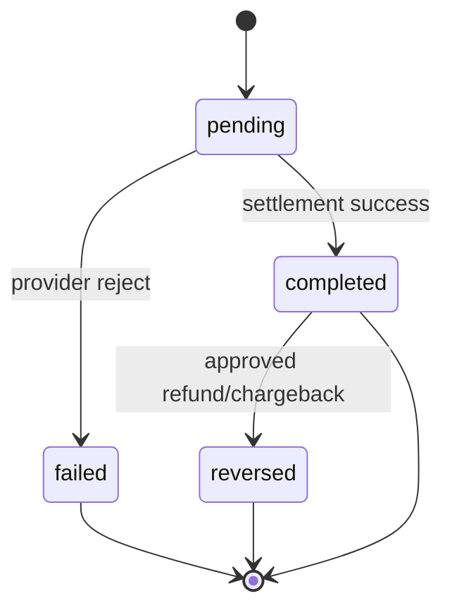
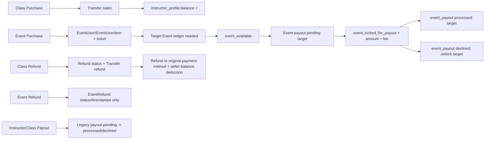

# Hammer Wallet

## 1. Mục tiêu nghiệp vụ

- Actor chính: Learner, Instructor, Event Organizer, Admin/Operations.
- Bài toán cần giải: xây dựng một Wallet Ledger thống nhất theo user để ghi nhận toàn bộ giao dịch mua, giao dịch bán, hoàn tiền, payout và trạng thái số dư theo từng stream class/event.

Phân loại mức độ xác nhận:

- ✅ Đã xác nhận từ code: class checkout, class refund, payout instructor, event checkout, event refund record.
- ⚠️ Giả định thiết kế: tách bucket class/event trong cùng một wallet.
- ❓ Cần chốt: event earning timing, event refund settlement, payout eligibility cho Event Organizer.

## 2. Phạm vi module

Module Hammer Wallet bao phủ:

- ghi nhận lịch sử giao dịch cho mọi user
- phản ánh chi tiêu của buyer
- phản ánh earnings của seller
- hỗ trợ refund, payout, reconciliation
- phân tách stream class và event

Ngoài phạm vi phase đầu:

- stored-value wallet kiểu nạp/rút tự do
- transfer P2P giữa user
- kế toán platform đầy đủ như ERP

## 3. Actor và touchpoint chính

| Actor | Touchpoint | Vai trò trong wallet |
| --- | --- | --- |
| Learner | Web/Mobile checkout, My Learning, lịch sử giao dịch | Phát sinh purchase qua payment provider và xem refund status về payment method gốc |
| Instructor | Web instructor console, payout | Phát sinh class earnings, class refund deduction, payout |
| Event Organizer | Event create/manage, payout event | Phát sinh event earnings, event refund deduction |
| Admin/Operations | Admin panel | Duyệt refund, xử lý payout, theo dõi bất thường |
| Payment Provider | Stripe | Charge, provider reference, reconciliation |

## 3.1 Touchpoint theo kênh

| Kênh | Touchpoint chính | Vai trò trong module |
| --- | --- | --- |
| hammer-web | checkout class/event, transaction history, payout request | Kênh vận hành chính cho class commerce và payout |
| hammer-mobile | social-first discovery, class/event consumption, lịch sử mua | Kênh consumption và engagement |
| hammer-api | checkout/refund/payout logic, admin operations | Nguồn sự thật nghiệp vụ |
| Admin console | refund approval, payout processing, reporting | Vận hành và kiểm soát rủi ro |

## 4. Luồng end-to-end

## 4.1 Luồng A — Class purchase

1. Buyer checkout cart.
2. Order và Order Item chuyển completed.
3. Line Item chuyển completed.
4. Paid Item được tạo/cập nhật để cấp entitlement.
5. Transfer loại `sales` được tạo cho seller/instructor.

Dựa trên code:

- `hammer-api/app/controllers/api/v1/users/cart/checkout.rb` (khoảng line 1-126)
- `hammer-api/app/models/transfer.rb` (khoảng line 1-22)

Đánh giá BA:

- ✅ Class purchase đã có business record và settlement log cơ bản.
- ⚠️ Chưa có buyer ledger riêng và before/after balance.

## 4.2 Luồng B — Class refund

1. Buyer tạo Refund request.
2. Admin cập nhật status refunded/processing/declined.
3. Nếu refunded: tạo Transfer loại `refund`.
4. Paid Item bị xóa và Line Item chuyển refunded.

Dựa trên code:

- `hammer-api/app/controllers/admin/refunds_controller.rb` (khoảng line 1-68)
- `hammer-api/app/models/transfer.rb` (khoảng line 1-22)

Đánh giá BA:

- ✅ Refund class đã có đối ứng settlement ở mức cơ bản.
- ⚠️ Chưa có chuẩn pending/available rollback theo wallet bucket.

## 4.3 Luồng C — Instructor payout

1. Instructor tạo Payout request.
2. Admin xử lý trạng thái.
3. Nếu processed: tạo Transfer loại `payout`.
4. Callback Transfer trừ `instructor_profile.balance`.

Dựa trên code:

- `hammer-api/app/controllers/admin/payouts_controller.rb` (khoảng line 1-49)
- `hammer-api/app/models/transfer.rb` (khoảng line 1-22)

Đánh giá BA:

- ✅ Payout class/instructor đã có flow vận hành.
- ⚠️ Balance đang mutable theo callback, khó audit.

## 4.4 Luồng D — Event checkout

1. Buyer checkout event order.
2. Hệ thống tạo EventUser và EventUserItem.
3. Hệ thống sinh EventUserTicket và ticket_code.
4. Event order completed, lưu purchase_id.

Dựa trên code:

- `hammer-api/app/controllers/api/v1/users/events/checkout_event_order.rb` (khoảng line 1-197)
- `hammer-api/app/controllers/api/v1/users/events/pay_now_event.rb` (khoảng line 1-118)

Đánh giá BA:

- ✅ Event purchase đã có order/ticket record.
- ⚠️ Chưa thấy settlement log kiểu Transfer earnings tương ứng.

## 4.5 Luồng E — Event refund

1. Buyer tạo Event Refund request.
2. Admin cập nhật status refunded/processing/declined.
3. Hiện tại chưa thấy logic tạo Transfer hoặc settlement đối ứng khi approved.

Dựa trên code:

- `hammer-api/app/models/event_refund.rb` (khoảng line 1-13)
- `hammer-api/app/controllers/admin/event_refunds_controller.rb` (khoảng line 1-74)

Đánh giá BA:

- ✅ Event refund đã có record trạng thái.
- ⚠️ Chưa hoàn chỉnh về finance settlement.

## 5. Data source / Data model

| Entity/Table | Field quan trọng | Vai trò |
| --- | --- | --- |
| Order | status, subtotal_price, purchase_id | Đơn hàng class tổng |
| Order Item | class_room_id, status, unit_price | Mục mua class/package |
| Line Item | status, unit_price | Chi tiết course/schedule |
| Paid Item | user_id, class_room_id | Entitlement sau mua class |
| Refund | status, amount, order_item_id | Request hoàn tiền class |
| Payout | status, amount, fee | Request payout |
| Payout Method | payment_type, info | Kênh nhận tiền |
| Transfer | transfer_type, amount, transferable_type/id | Settlement log hiện tại |
| EventUser | status, purchase_id, total | Event order |
| EventUserItem | quantity, unit_price, total_amount | Chi tiết ticket purchase |
| EventUserTicket | ticket_code, status | Vé cụ thể |
| EventRefund | status, amount, event_user_id | Request hoàn tiền event |

## 6. Business rules hiện tại và mục tiêu

## 6.1 Business rules hiện tại (dựa trên code)

- ✅ Class checkout có tạo Transfer sales.
- ✅ Class refund có tạo Transfer refund.
- ✅ Payout có tạo Transfer payout.
- ✅ Transfer.after_create cập nhật trực tiếp balance của instructor.
- ⚠️ Event checkout chưa thấy tạo Transfer earnings song song.
- ⚠️ Event refund approved chưa thấy settlement log đối ứng.

## 6.2 Business rules mục tiêu cho Hammer Wallet

- Một user có một Wallet Ledger logic.
- Tách balance bucket theo stream:
  - class_pending
  - class_available
  - event_pending
  - event_available
  - locked_for_payout
- Mọi purchase/refund/payout đều phải ghi transaction đối ứng.
- Balance là trạng thái suy ra từ ledger hoặc snapshot được cập nhật từ ledger.
- Payout dựa trên earning stream, không dựa cứng vào role.

## 6.3 Ma trận trạng thái nghiệp vụ liên quan Wallet

| Thực thể | Trạng thái hiện có | Ý nghĩa đối với wallet | Nguồn |
| --- | --- | --- | --- |
| Order | created, completed | Xác nhận class purchase đã hoàn tất hay chưa | code backend ✅ |
| Order Item | created, completed, refunded | Xác định sale/refund theo từng mục mua | code backend ✅ |
| Line Item | created, completed, refunded | Chi tiết phần entitlement bị ảnh hưởng | code backend ✅ |
| Refund | pending, processing, refunded, declined | Quyết định khi nào buyer được credit và seller bị debit | code backend ✅ |
| Payout | pending, processed, declined | Quyết định khi nào locked balance được trừ hẳn | code backend ✅ |
| EventUser | created, completed, cancelled | Trạng thái event order | code backend ✅ |
| EventRefund | pending, processing, refunded, declined | Có refund record nhưng thiếu settlement log | code backend ✅/⚠️ |

Đánh giá BA:

- ✅ Trạng thái nghiệp vụ class khá rõ.
- ⚠️ Trạng thái event có record nhưng chưa nối hoàn chỉnh sang finance settlement.
- ❓ Chưa có status chuẩn cho wallet transaction như pending/completed/reversed ở level ledger mới.

## 6.4 State transition draft cho Wallet Transaction (mục tiêu)



Ghi chú:

- ⚠️ Đây là state machine mục tiêu cho Wallet Ledger mới.
- ✅ Hiện tại nhiều trạng thái đang nằm rải rác ở Order/Refund/Payout/EventRefund thay vì một wallet transaction lifecycle thống nhất.

## 7. Mapping screen → API → entity

| Screen/Touchpoint | API/Controller | Entity chính |
| --- | --- | --- |
| Checkout class | `API::V1::Users::Cart::Checkout` | Order, Order Item, Line Item, Paid Item, Transfer |
| Refund class | `API::V1::Users::Users::Refunds` + `Admin::RefundsController` | Refund, Paid Item, Transfer |
| Payout instructor | `Admin::PayoutsController` + instructor payout web flow | Payout, Payout Method, Transfer |
| Checkout event | `API::V1::Users::Events::CheckoutEventOrder`, `PayNowEvent` | EventUser, EventUserItem, EventUserTicket |
| Refund event | `Admin::EventRefundsController` | EventRefund |

## 7.1 Mapping app → API → entity → wallet effect

| App/Screen | API | Entity | Wallet effect mong muốn |
| --- | --- | --- | --- |
| Web/Mobile checkout class | Cart Checkout | Order, Order Item, Paid Item, Transfer | buyer card charge + seller Transfer sales |
| Admin refund class | RefundsController#update | Refund, Transfer | refund về payment method gốc + seller Transfer refund |
| Web instructor payout | payout request flow + admin payout process | Payout, Payout Method, Transfer | available -> locked -> payout processed |
| Web/Mobile checkout event | CheckoutEventOrder / PayNowEvent | EventUser, EventUserItem, EventUserTicket | buyer card charge + event seller credit target |
| Admin refund event | EventRefundsController#update | EventRefund | refund status/timestamp; settlement target hiện chưa đủ |

## 7.2 API gaps cần có nếu triển khai Wallet Ledger

- `GET /wallet/overview`
- `GET /wallet/transactions`
- `GET /wallet/earnings?stream=class|event`
- `POST /wallet/payout-requests`
- `GET /wallet/payout-requests/:id`
- `GET /wallet/transaction/:id`

Ghi chú:

- ⚠️ Đây là đề xuất API mục tiêu, chưa phải API hiện có.

## 8. Edge cases

| # | Edge case | Tác động |
| --- | --- | --- |
| 1 | User vừa là buyer vừa là seller ở hai stream khác nhau | Cần tách rõ inflow/outflow theo stream |
| 2 | Event Organizer không có role instructor nhưng vẫn cần payout | Role không đủ để quyết định payout eligibility |
| 3 | Refund xảy ra khi earnings đã payout một phần | Cần quy tắc offset/negative balance/manual adjustment |
| 4 | Payment callback hoặc retry tạo transaction trùng | Cần idempotency key |
| 5 | Event checkout có nhiều ticket type trong một order | Cần reference/correlation đủ chi tiết |
| 6 | Event refund chưa có settlement log khiến số liệu class/event lệch nhau | Rủi ro reporting và reconciliation |
| 7 | Payout request đồng thời ở class và event | Cần khóa bucket đúng stream |
| 8 | Seller đổi payout method giữa lúc pending xử lý | Cần snapshot payout info tại thời điểm request |

## 9. KPI liên quan module Wallet

| KPI | Định nghĩa ngắn | Ghi chú |
| --- | --- | --- |
| GMV class | Tổng giá trị giao dịch class | Tách khỏi event |
| GMV event | Tổng giá trị giao dịch event | Tách khỏi class |
| Refund rate class/event | Refund amount / GMV theo từng stream | Không gộp chung |
| Payout lead time | Thời gian từ request đến processed | Theo stream nếu policy khác nhau |
| Net revenue | Doanh thu ròng sau fee và refund | Cần thống nhất công thức |
| Pending liability | Tổng pending earnings chưa available | Rất quan trọng cho treasury view |
| Reconciliation mismatch count | Số giao dịch lệch với provider | Đo chất lượng settlement |

## 10. Câu hỏi cần chốt

- [ ] Event earning được ghi nhận ở thời điểm checkout hay sau khi event kết thúc?
- [ ] Event refund có cần tạo settlement log và debit seller giống class refund không?
- [ ] Event Organizer có dùng cùng payout engine với Instructor không?
- [ ] Hold period cho class và event có giống nhau không?
- [ ] Có cần phân biệt payout method cho class stream và event stream không?

## 11. Open issues / giả định

| # | Mô tả | Trạng thái |
| --- | --- | --- |
| 1 | Class flow đã có settlement log cơ bản qua Transfer | ✅ |
| 2 | Event checkout chưa có earnings log tương ứng | ⚠️ |
| 3 | Event refund approved chưa có settlement log tương ứng | ⚠️ |
| 4 | Wallet multi-bucket là hướng thiết kế, chưa phải code hiện tại | ⚠️ |
| 5 | Payout by earning stream là khuyến nghị, chưa phải business rule cuối | ❓ |

## 12. Đề xuất phương án

## Phương án A — Giữ Transfer, mở rộng dần thành Wallet Ledger

Mô tả:

- Dùng Transfer làm nền.
- Bổ sung thêm stream_type, entry_type, before/after balance, buyer-side records.
- Mở rộng để cover event settlement.

Ưu điểm:

- Ít thay đổi hơn với code hiện tại.
- Tận dụng được dữ liệu/logic đang chạy.
- Time-to-market nhanh hơn.

Nhược điểm:

- Transfer hiện được thiết kế thiên về instructor settlement.
- Dễ kéo theo technical debt nếu tiếp tục chắp vá.
- Khó đạt auditability chuẩn nếu schema không được tái thiết kế đủ mạnh.

## Phương án B — Xây Wallet Ledger mới, giữ Transfer như compatibility layer

Mô tả:

- Tạo bảng Wallet và Wallet Transaction mới.
- Transfer vẫn tồn tại để tương thích legacy/report hiện tại.
- Finance source of truth chuyển sang Wallet Ledger.

Ưu điểm:

- Thiết kế sạch hơn, chuẩn audit hơn.
- Dễ tách class/event stream.
- Dễ mở rộng reconciliation, dispute, platform treasury về sau.

Nhược điểm:

- Scope backend lớn hơn.
- Cần migration strategy và mapping từ model cũ.
- Tốn thêm effort QC/UAT.

## Khuyến nghị

Nên triển khai Phương án B theo lộ trình phase-based:

1. Xây Wallet Ledger mới.
2. Ghi transaction mới song song với logic hiện tại.
3. Chuẩn hóa event settlement.
4. Chuyển dần payout/refund reporting sang Wallet Ledger.

Lý do:

- Hammer đang có cả class commerce và event commerce.
- User có thể là buyer, event seller và instructor cùng lúc.
- Nếu chỉ vá Transfer, kiến trúc tài chính sẽ tiếp tục lệch giữa class và event.

## Điều kiện cần để triển khai

- Chốt business owner cho policy event payout/refund.
- Chốt taxonomy transaction và stream type.
- Chốt mapping giữa records cũ và wallet transaction mới.
- Có kế hoạch migration/reporting song song ít nhất một phase.
- Có QA scenarios riêng cho class và event settlement.

## 13. Gợi ý rollout theo phase

### Phase 1 — Ledger foundation

- Tạo Wallet + Wallet Transaction.
- Ghi class purchase/refund/payout vào ledger mới.
- Chưa thay thế hoàn toàn reporting cũ.

### Phase 2 — Event settlement completion

- Bổ sung event earning settlement.
- Bổ sung event refund settlement đối ứng.
- Tách payout request theo stream.

### Phase 3 — Reporting và reconciliation

- Wallet overview.
- Transaction history.
- Earnings breakdown.
- Reconciliation dashboard.

## 14. Owner gợi ý

| Hạng mục | Owner chính |
| --- | --- |
| Business rules payout/refund | BA + Product Owner |
| Wallet schema và service design | Dev Lead |
| UI wallet/payout | Designer + Frontend |
| Test matrix class/event settlement | QC |
| Migration strategy và rollout | Dev Lead + Ops |

## 15. Delta update (2026-03-31) — Knowledge Pipeline `hammer wallet`

### 15.1 Map theo 4 lớp tài liệu

1. Toàn cảnh:
- Vai trò Wallet trong hệ sinh thái Hammer được giữ theo hướng user-centric ledger.

2. Trung gian:
- Chuẩn hóa lại bridge business-tech trên knowledge web: Focus -> Overview -> Detail.
- Bổ sung điều hướng hai chiều để xem tác động từ module lên tổng quan và ngược lại.

3. Chi tiết:
- Củng cố hiển thị flow-state-rule-KPI cho module Wallet qua tab chi tiết và 3 lớp diagram Mermaid.
- Bổ sung keyword bar theo section để BA/PO/Dev chốt nhanh từ khóa vận hành.

4. Delta:
- Tinh chỉnh chuẩn web quản lý (sidebar 25% + popup đối chiếu markdown + panel tiến trình 6 bước).
- Đồng bộ dữ liệu graph để đảm bảo text tiếng Việt có dấu đầy đủ.

### 15.2 Tác động business

- Giảm thời gian onboard stakeholder mới nhờ thứ tự đọc top-down rõ ràng.
- Tăng khả năng review quyết định payout/refund liên quan wallet vì có view Focus và down-top impact.

### 15.3 Tác động kỹ thuật

- Không thay đổi API nghiệp vụ lõi của hammer-api ở run này.
- Tập trung vào lớp tri thức và runtime knowledge web (render, navigation, progress).

### 15.4 Rủi ro còn mở

- Event settlement rule vẫn là điểm cần chốt để hoàn thiện target Wallet Ledger.
- Cần quyết định cuối về payout eligibility của Event Organizer trước khi hiện thực phase sâu.

## 16. Context triển khai Hammer Wallet (2026-03-31)

### 16.1 Phạm vi công việc user sẽ triển khai

1. User Wallet System: xây hệ thống wallet tập trung giữ funds (USD) cho toàn bộ user, làm nền cho transaction recording; payout trong wallet chỉ áp dụng cho Event.
2. Define Transaction Flow & States: logic Credit (Sales/Refund), Debit (Buy/Withdraw), lifecycle (Pending/Available/Fail).
3. Create Functional Wireframes: mô tả Wallet Dashboard và Transaction History.
4. Design Wallet Dashboard UI: balance display, action buttons, interaction states.
5. Design Transaction UI: history list và invoice detail.
6. Architect Ledger DB: đảm bảo financial accuracy + immutable audit logs.
7. Develop Core Transaction APIs: transfer handling, fee deduction.
8. Implement Wallet Dashboard: build UI + integrate API cho real-time balance.
9. Implement History & Detail: build UI + integrate API cho list/detail.
10. Test wallet logic và fix bugs.

### 16.2 Phân loại giao dịch

#### 16.2.1 As-is hiện tại (đã thấy trong code)

| Transaction type | Trạng thái hiện tại |
| --- | --- |
| class_purchase | Có settlement log qua Transfer sales |
| class_refund | Có settlement log qua Transfer refund |
| instructor_payout_legacy | Có flow payout legacy qua Payout + Transfer payout |
| event_purchase | Có record commerce (EventUser/EventUserItem), chưa thấy Transfer earnings đối ứng đồng nhất như class |
| event_refund | Có EventRefund record status, settlement log đối ứng chưa đầy đủ |
| event_payout | Đang là hướng triển khai Wallet phase cho Event payout; một type với status pending/processed/declined |
| dance_coin_reward_grant/event_purchase_coin/course_purchase_coin | Thuộc taxonomy Wallet target cho tài sản Dance Coin |

#### 16.2.2 Target Wallet Ledger

| Transaction type | Nhóm | Chiều tiền | Ghi nhận ledger |
| --- | --- | --- | --- |
| class_purchase | commerce | debit buyer | buyer card/payment charged; seller_class_balance + qua Transfer sales hiện tại |
| event_purchase | commerce | debit buyer | buyer card/payment charged; seller_event_pending + chỉ là target khi Event settlement được bổ sung |
| class_refund | adjustment | refund to original payment | refund về payment method/card gốc; seller_class_balance - qua Transfer refund |
| event_refund | adjustment | refund status | target refund về payment method/card gốc; seller_event_* chỉ trừ khi Event settlement được implement |
| event_payout | payout (event) | lock/debit/unlock seller wallet | pending: event_available -(amount + fee), event_locked_for_payout +(amount + fee); processed: event_locked_for_payout -(amount + fee); declined: unlock về event_available |
| instructor_payout_legacy | payout (class) | xử lý ở flow hiện tại | ngoài phạm vi wallet mới |
| fee_deduction | platform fee | debit seller stream | class/event available - |

#### 16.2.3 Type/status matrix cho Wallet UI

| Transaction type | Status hợp lệ | Khi user mua xong rồi hủy |
| --- | --- | --- |
| class_purchase | completed, failed | Purchase gốc giữ completed; tạo class_refund để thể hiện hủy/hoàn tiền |
| event_purchase | completed, failed | Purchase gốc giữ completed; tạo event_refund và EventUser chuyển cancelled |
| class_refund | pending, processing, refunded, declined | Đây là dòng hiển thị yêu cầu hủy khóa |
| event_refund | pending, processing, refunded, declined | Đây là dòng hiển thị yêu cầu hủy vé |
| class_sales_credit | completed | Refund tạo Transfer refund riêng, không đổi sale row gốc |
| event_sales_credit | pending, completed, failed | Target ledger cho event earnings, source hiện chưa có Transfer đồng nhất |
| event_payout | pending, processed, declined | Một type payout duy nhất, không tách request/processed thành hai transaction type |
| instructor_payout_legacy | pending, processed, declined | Chỉ để đối soát class/instructor payout legacy |

### 16.3 Hệ thống ghi nhận giao dịch như thế nào

1. Mọi giao dịch tạo transaction record với `reference_id`, `idempotency_key`, `stream_type`, `transaction_type`, `status`.
2. Mỗi transaction phải có before/after balance snapshot theo bucket.
3. Commerce/refund phải tách rõ payment-provider movement và wallet/earning ledger movement; không gọi refund là credit vào buyer wallet nếu source đang hoàn về payment method/card gốc.
4. Pending chỉ chuyển sang Available qua rule release rõ ràng (scheduler/policy) khi business rule đã chốt; class Transfer hiện tại đang cộng thẳng `instructor_profile.balance`.
5. Wallet chỉ xử lý event payout target: trích amount + fee từ event_available; nếu fail phải hoàn lock về event_available.
6. Instructor/Class payout giữ nguyên flow legacy hiện tại (không migrate trong phase này) với status pending/processed/declined.

### 16.4 Mermaid flow riêng cho Hammer Wallet



### 16.5 Cách hiển thị trên mobile app (target UX)

- Wallet Dashboard:
  - balance tổng + balance theo bucket (class/event/locked)
  - action buttons: withdraw, history, detail
- Transaction History:
  - filter nhanh: all/in/out/pending
  - item card gồm amount, status, timestamp, type
- Invoice Detail:
  - mã giao dịch, reference, stream, status, amount
  - phần “Ledger ghi nhận” để BA/Ops hiểu vì sao balance thay đổi

### 16.6 Pros/Cons, lưu ý và cải thiện đề xuất

- Pros:
  - Tách rủi ro rollout: giữ nguyên class/instructor payout đang vận hành ổn định.
  - Event payout có thể chuẩn hóa nhanh trên wallet ledger mới.
  - Dễ audit hơn cho stream event vì lock/unlock/processed theo một lifecycle riêng.
- Cons:
  - Có 2 payout engine song song (event mới + instructor legacy) làm tăng chi phí vận hành.
  - Reporting payout toàn hệ sinh thái cần hợp nhất từ nhiều nguồn.
  - Team Ops phải nắm rõ boundary để tránh xử lý nhầm luồng.
- Lưu ý triển khai:
  - Bắt buộc gắn stream + reference id + idempotency key cho mọi event payout transaction.
  - Dashboard/BI phải tách KPI payout theo stream class/event để tránh nhiễu số.
  - SLA xử lý payout event cần định nghĩa riêng với fallback rõ ràng khi fail/retry.
- Cải thiện đề xuất:
  - Chuẩn hóa schema ledger event trước, sau đó tạo compatibility adapter cho báo cáo unified.
  - Thiết kế contract API rõ cho event payout (`request`, `process`, `fail/reverse`).
  - Chỉ cân nhắc migrate instructor payout khi event payout đạt ổn định KPI và audit.

  ## 17. Mockup note - Legacy payout warning + Reconciliation dashboard

  Scope section này chỉ mô tả mockup UI và tri thức Knowledge Web, không phải thay đổi code runtime.

  ### 17.1 Mục tiêu mockup

  - Khi user thao tác payout Class Room, phải thấy rõ đang đi Instructor Legacy flow.
  - Trong cùng màn hình, phải có block reconciliation tách riêng:
    - Event Wallet
    - Instructor Legacy
  - Mọi số liệu cần đọc được theo 3 nhóm: available, pending, total.

  ### 17.2 Wireframe đề xuất

  ```text
  ---------------------------------------------------------------
  Performance / Payout

  Current Balance                           [Request Withdrawal]
                (i)

  [Warning]
  Class payout currently runs on Instructor Legacy flow.

  Reconciliation Snapshot

  | Event Wallet        | Instructor Legacy |
  | available: xxx      | available: yyy    |
  | pending:   xxx      | pending:   yyy    |
  | total:     xxx      | total:     yyy    |

  Note: Reconcile both streams before submit.
  ---------------------------------------------------------------
  ```

  ### 17.3 Tooltip / warning content draft

  - i-icon tooltip: Current balance ở khu vực này phản ánh payout theo luồng Instructor Legacy cho Class Room.
  - warning banner: Class payout hiện xử lý qua Instructor Legacy flow, vui lòng đối soát Event Wallet và Instructor Legacy trước khi gửi yêu cầu.

  ### 17.4 Naming guideline để giảm rủi ro review store

  - Trên mobile/app store facing copy, ưu tiên dùng:
    - Earnings Balance
    - Creator Earnings
    - Settlement Balance
  - Tránh đẩy từ "Wallet" làm label chính trên bề mặt app nếu có thể bị hiểu là bypass in-app purchase policy.
  - Nội bộ domain vẫn giữ thuật ngữ Wallet Ledger để không phá vỡ ngữ nghĩa kỹ thuật.

  ### 17.5 Acceptance criteria (mockup)

  - Có i-icon ở ngay cụm balance.
  - Có warning banner ở trước CTA payout.
  - Có reconciliation split card: Event Wallet vs Instructor Legacy.
  - Có note nhắc user đối soát trước khi submit payout.
  - Nội dung copy tách rõ stream class/event.

  ## 18. UX direction - Dance Coin + Event-only payout

  Section này bổ sung mockup định hướng cho giai đoạn có reward point (Dance Coin) và trạng thái payout hiện chỉ áp dụng cho Event.

  ### 18.1 Naming strategy khi có Dance Coin

  - Không dùng một nhãn chung Wallet cho mọi loại giá trị.
  - Dùng nhãn theo asset để tránh nhầm giữa tiền thật và điểm thưởng:
    - Cash: Earnings Balance
    - Point: Dance Coin
  - Tên cụm tổng thể đề xuất:
    - Earnings & Rewards
    - Earnings + Dance Coin
    - Balance Center

  Khuyến nghị:

  - User-facing chính: Earnings & Rewards.
  - Domain nội bộ vẫn giữ Wallet Ledger để không phá architecture term.

  ### 18.2 Event-only payout CTA

  Vì payout hiện chỉ có Event, CTA nên ghi rõ Event:

  - Primary CTA: Request Event Payout
  - Secondary link: View Event Payout History

  Không nên dùng CTA chung kiểu Request Withdrawal ở màn tổng hợp vì dễ hiểu nhầm Course/Class cũng rút được.

  ### 18.3 Teaching button dài chỉ dành cho teaching

  Nếu vẫn cần long button cho teaching operations, tách rõ thành nhóm riêng:

  - Teaching section button: Manage Teaching Settings
  - Teaching section không hiển thị CTA payout event.

  Nguyên tắc hiển thị:

  - Ở Event tab: có Request Event Payout.
  - Ở Teaching tab: chỉ có action teaching (không có payout event CTA).

  ### 18.4 Transaction taxonomy nên tách Event và Course

  Nên phân loại transaction theo 3 trục để UX lọc nhanh và báo cáo sạch:

  1. Stream:
  - Event
  - Course

  2. Asset:
  - Cash
  - Dance Coin

  3. Direction:
  - Inflow
  - Outflow

  Transaction type đề xuất tối thiểu:

  - Event Purchase (Cash)
  - Event Purchase (Dance Coin)
  - Course Purchase (Cash)
  - Course Purchase (Dance Coin)
  - Event Refund
  - Course Refund
  - Event Payout Request
  - Event Payout Processed
  - Reward Grant (Dance Coin)
  - Reward Expired (Dance Coin)

  ### 18.5 Mockup wireframe v2

  ```text
  -----------------------------------------------------------------
  Earnings & Rewards

  [Tab] Event Earnings | Course Earnings | Dance Coin

  Event Earnings
  Available: xxx
  Pending: yyy
  [Request Event Payout]

  Course Earnings
  Available: zzz
  Pending: ttt
  [Manage Teaching Settings]

  Dance Coin
  Balance: ccc
  Hint: Can be used to purchase eligible Event/Course items.

  Transactions
  Filter: Stream(Event/Course) | Asset(Cash/Coin) | Direction(In/Out)
  -----------------------------------------------------------------
  ```

  ### 18.6 Acceptance criteria bổ sung

  - CTA payout luôn ghi rõ Event khi payout chỉ hỗ trợ Event.
  - Teaching action không lẫn với payout action.
  - Transaction list có filter Stream + Asset + Direction.
  - Mọi item mua bằng Dance Coin hiển thị rõ loại tài sản, không trộn với Cash.
